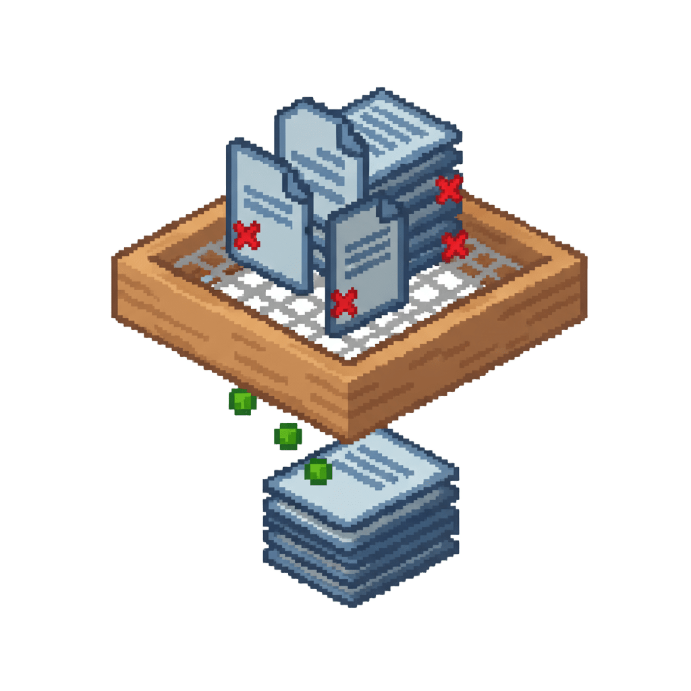

- [简体中文版](./README.md)
- 繁體中文版
- [English version](./README_EN.md)

  

# N-LogFilter - 過濾掉煩人且無害的日誌

## 壹、簡介
Log Sifter 是一個為 Minecraft NeoForge 伺服器與客戶端設計的模組（内部開發代號：Arona-02），專門用於過濾和遮蔽遊戲運行過程中產生的冗餘日誌資訊。該模組基於 NeoForge 平台開發，通過自定義配置規則，幫助用戶減少日誌檔案中的噪音，使重要資訊更加清晰可見。

## 贰、主要特性
- **日誌過濾**：通過配置檔案定義規則來遮蔽特定的日誌輸出
- **正規表示式支援**：支援使用正規表示式精確匹配日誌內容
- **動態配置**：支援在運行時載入和應用過濾規則
- **輕量級設計**：不修改遊戲核心功能，僅專注於日誌管理

## 叁、安装指南

### 3-1：前提條件
- 已安裝支援的 Minecraft 版本（1.21.1）
- 已安裝對應版本的 NeoForge（21.1.200或更高版本）

### 3-2：安装步骤
1. 從項目的 [Release 页面](https://github.com/MC-Nirvana/Log-Sifter/releases/latest) 下載最新版本
2. 將模組檔案放入客戶端（或者伺服器）的 `mods` 資料夾中
3. 啟動遊戲，模組會在 `config` 目錄下自動生成預設配置檔案
4. 根據需要編輯配置檔案
5. 重啟伺服器使更改生效
6. 享受 Log Sifter 帶來的乾淨的控制台和日誌

## 肆、從原始碼建置
如果你想從原始碼建置外掛，你需要 Java Development Kit (JDK) 21 或更高版本

### 4-1：建置步驟
1. 複製儲存庫：`git clone https://github.com/MC-Nirvana/Log-Sifter.git`
2. 進入儲存庫目錄：`cd Log-Sifter`
3. 執行建置命令：`./gradlew build`
4. 在 `build/libs/` 目錄下找到生成的 JAR 檔案

### 4-2：開發環境設定
- 推薦使用 IntelliJ IDEA 進行開發
- 匯入項目後，確保 Gradle 相依性能夠正確下載

## 伍、貢獻與支援
歡迎通過 GitHub Issues 提交 Bug 報告和功能建議

### 5-1：貢獻方式
- 提交程式碼改進和新功能實現
- 完善文件和翻譯
- 報告 Bug 和安全問題
- 參與討論和提供使用回饋

### 5-2：提交 Pull Request 的最佳實踐
1. Fork 項目並建立功能分支
2. 編寫清晰的提交資訊
3. 確保程式碼符合項目編碼規範
4. 添加相應的測試用例
5. 保持 Pull Request 聚焦於單一功能或修復

### 5-3：開發者資源
- 項目遵循標準的 Git 工作流程
- 請在提交 Pull Request 前確保程式碼通過所有測試
- 保持程式碼風格一致，參考現有程式碼結構

## 陆、許可證
本項目採用 [MIT license](LICENSE) 開源許可證

## 柒、支援與回饋
如果你喜歡這個項目，請考慮：
- 給項目點個 Star ⭐
- 在社交媒體上分享這個項目
- 參與項目討論，提供寶貴意見

### 捌、贊助支援
如果你希望支援本項目的持續開發和維護，可以通過以下方式贊助：

- [愛發電](https://ifdian.net/a/MC-Nirvana) - 通過愛發電贊助（適用於中國大陸地區用戶）
- [PayPal](https://paypal.me/WHFNirvana) - 通過 PayPal 贊助（適用於海外用戶）

您的贊助將用於：
- 維護項目基礎設施
- 請作者去碼頭整點薯條:)

## 玖、官方社群
- [QQ](https://qm.qq.com/q/u1FEfZMFe8)
- [Discord](https://discord.gg/4CVVEkC9aB)